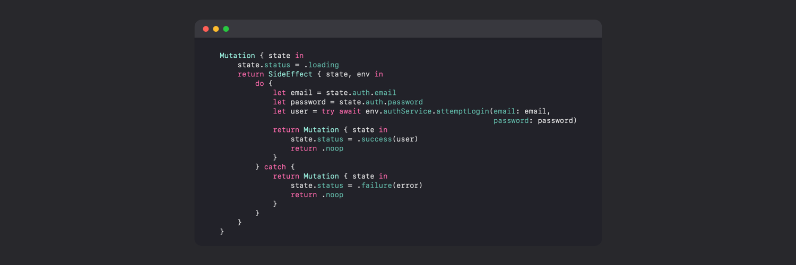

# Hako
[箱 - hah-koo - box - 📦]

Hako is a barebone, thread-safe state container written in Swift. The first building block in a scalable and predictable, UI-centric architecture. It was designed with SwiftUI in mind, but can be used with UIKit/AppKit as well and works on all Apple platforms. 

## Guiding principles

1. Simplicity 
An architecture with a steep learning curve opens the path to ambiguity and, in time, disaster. Which is exactly what Hako tries to avoid. In fact, Hako is so uninvolved you could probably build it yourself in less than a day. This library is all about the idea, not the implementation.

2. A strong core, but soft edges
Although heavily opinionated on how state should be managed in an UI-centric app, Hako adds just a few core concepts, allowing the developer to extend and build uppon them with great flexibility. 

3. Testability
Beyond being simple, a solid architecture should allow the overlying codebase to be easily tested.  

4. Ergonomics and a developer-first approach
As developers, we're spending much more time reading code than writing code. Hako attempts to make state management a pleasure to read, follow and understand. 
